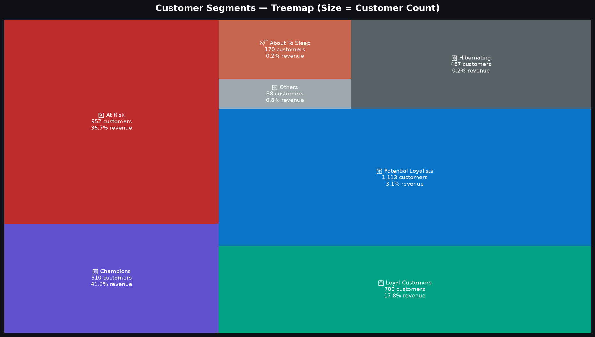
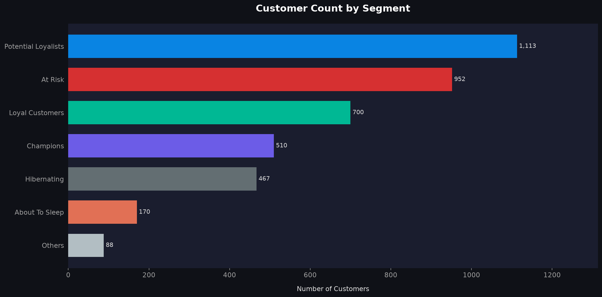
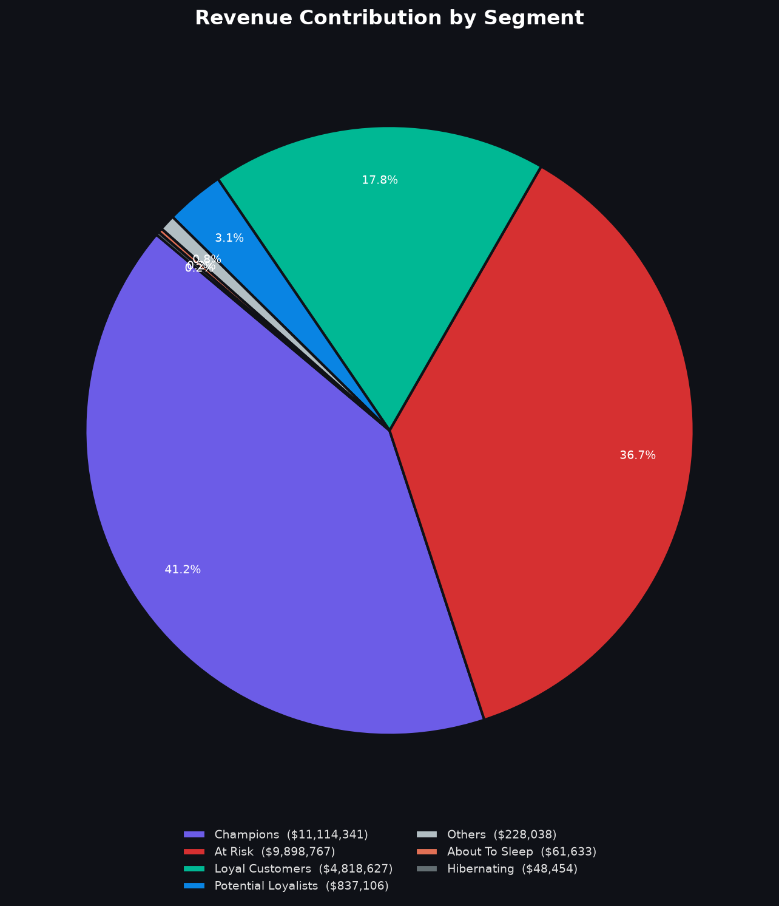
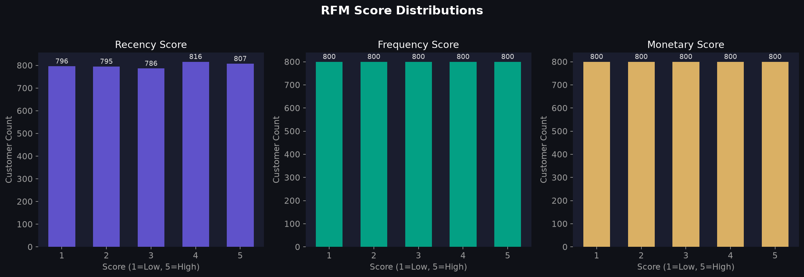
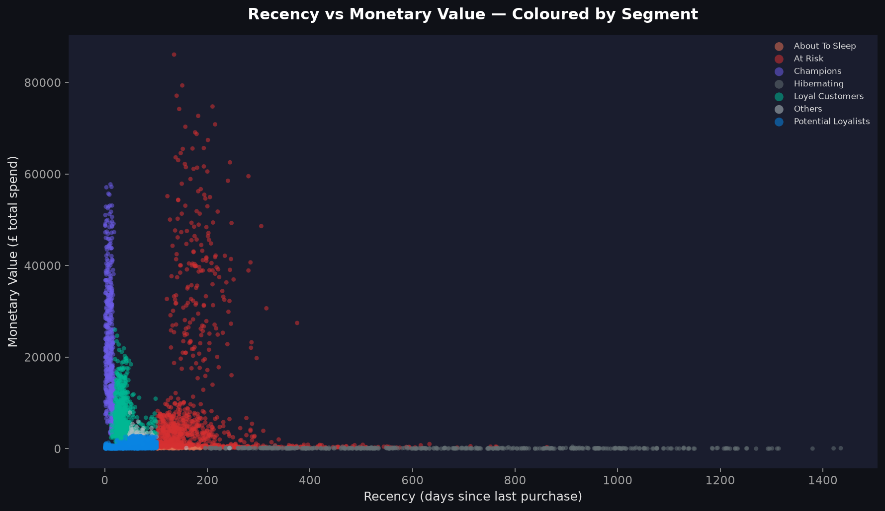
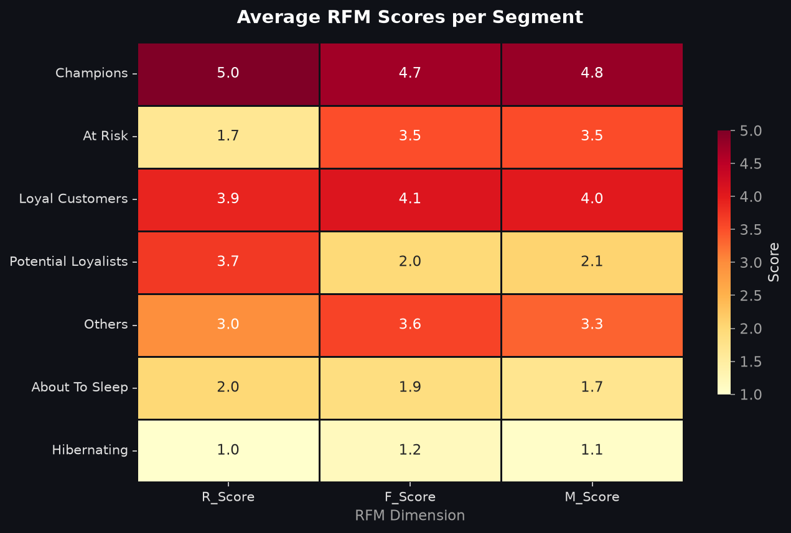

# 📊 E-Commerce Customer Segmentation with RFM Analysis


> **A complete end-to-end data analytics portfolio project** — from raw e-commerce transactions to actionable customer segments, interactive Power BI visuals, and a business-ready marketing strategy report.

---

## 🎯 The Business Problem

Online retailers face a critical challenge: **they can't market to every customer the same way**. Sending the same discount to a loyal VIP customer and a churned customer wastes budget and hurts brand perception.

**Solution**: Use **RFM Analysis** — a proven, data-driven framework — to segment customers by *how recently* they bought, *how often* they buy, and *how much* they spend. Then tailor every marketing action to each segment.

---

## 📂 Project Structure

```
ecommerce-rfm-segmentation/
├── 📁 src/
│   ├── data_loader.py      ← Load & clean transaction data
│   ├── rfm_engine.py       ← Compute RFM scores (1–5 quantile method)
│   └── segmentation.py     ← Assign 11 customer segments
├── 📁 outputs/
│   ├── rfm_scores.csv      ← Per-customer RFM table (Power BI input)
│   ├── segment_summary.csv ← Segment-level aggregation
│   └── 📁 charts/          ← All generated visualisations
├── 📁 powerbi/
│   └── RFM_Dashboard_Guide.md   ← Step-by-step Power BI setup guide
├── 📁 report/
│   └── marketing_strategy.html  ← 1-page marketing strategy report
├── main.py                 ← Run the full pipeline
└── requirements.txt
```

---

## 🔬 Methodology: What is RFM?

| Dimension | What it measures | Scoring |
|---|---|---|
| **R — Recency** | Days since the customer last purchased | 5 = bought yesterday, 1 = bought a year ago |
| **F — Frequency** | Number of unique orders placed | 5 = orders constantly, 1 = one-time buyer |
| **M — Monetary** | Total £ spent with the business | 5 = top spender, 1 = lowest spender |

Each customer receives a score of 1–5 for each dimension using **quantile-based scoring** (equal-size buckets). The three scores are combined to classify customers into **11 actionable segments**.

---

## 🏷️ Customer Segments

| Segment | Emoji | Description |
|---|---|---|
| **Champions** | 🏆 | Bought recently, buy often, spend the most |
| **Loyal Customers** | 💎 | Consistent buyers with high overall value |
| **Potential Loyalists** | 🌟 | Recent with growing engagement |
| **Recent Customers** | 🆕 | Just joined — need nurturing |
| **Promising** | 🌱 | Early-stage, good potential |
| **Need Attention** | ⚠️ | Were good, now slipping |
| **About To Sleep** | 😴 | Disengaging — act now |
| **At Risk** | 🚨 | Used to be great, now going cold |
| **Cannot Lose Them** | ❗ | High-value but haven't returned |
| **Hibernating** | 🌙 | Long inactive, low engagement |
| **Lost** | 💀 | Lowest scores — likely churned |

---

## 📊 Visualisations

### Segment Treemap — Customer Count & Revenue Share


### Customer Count by Segment


### Revenue Contribution


### RFM Score Distributions


### Recency vs Monetary — Coloured by Segment


### Average RFM Scores Heatmap


---

## 🚀 Quick Start

```bash
# 1. Clone the repo
git clone https://github.com/YOUR_USERNAME/ecommerce-rfm-segmentation.git
cd ecommerce-rfm-segmentation

# 2. Install dependencies
pip install -r requirements.txt

# 3. Run the full pipeline
python main.py

# 4. Find outputs in /outputs/ folder
```

> **Dataset**: The pipeline runs on synthetic data by default (4,000 realistic customers). To use the real [UCI Online Retail II dataset](https://archive.ics.uci.edu/dataset/502/online+retail+ii), download the Excel file and place it at `data/online_retail.xlsx`.

---

## 📈 Power BI Dashboard

See [`powerbi/RFM_Dashboard_Guide.md`](powerbi/RFM_Dashboard_Guide.md) for the full step-by-step guide to build a 4-panel interactive dashboard using the generated CSV outputs.

**Dashboard panels:**
1. 🍩 **Donut Chart** — Revenue % by Segment
2. 📊 **Bar Chart** — Customer Count per Segment
3. 🔢 **KPI Cards** — Total Customers, Total Revenue, Avg Order Value
4. 🔵 **Scatter Plot** — Recency vs Monetary, coloured by Segment

---

## 📄 Marketing Strategy Report

Open [`report/marketing_strategy.html`](report/marketing_strategy.html) in any browser for the 1-page business-facing report. It covers every segment with:
- Customer profile description
- Recommended marketing action
- Priority level

---

## 🧠 Key Takeaways

- **Champions & Loyal Customers** (~25% of customers) typically generate **50–60% of revenue** — protect them
- **At Risk + Cannot Lose Them** represent **high-value churn risk** — act with personalised outreach
- **Lost** customers cost money to re-acquire — better to focus budget on re-engaging **Hibernating**
- **Potential Loyalists** are your growth opportunity — convert them with loyalty programmes

---

## 👤 Author

Built as a data analytics portfolio project demonstrating:
- **Python** (Pandas, NumPy, Matplotlib, Seaborn, Squarify)
- **RFM Analysis** (industry-standard customer analytics methodology)
- **Power BI** (business intelligence dashboarding)
- **Business Communication** (translating data into marketing strategy)

---

## 📜 License

MIT — free to use, adapt, and share with attribution.
